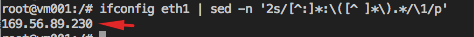
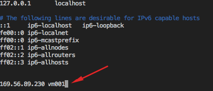
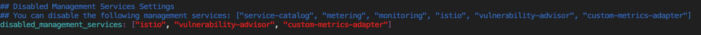
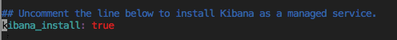

# IBM Cloud Private 설치 

## IBM Cloud Private CE (Community Edition) 설치하기
설치 매뉴얼 전문은 [Knowledge Center](https://www.ibm.com/support/knowledgecenter/SSBS6K_2.1.0.3/installing/install_containers_CE.html) 를 참고하시기 바랍니다.
본 실습은 편의성을 위해 Single Node에 Kubernetes 클러스터를 설치합니다.


### Pre-requisite 
`Host` 파일 수정하기 
~~~
vi /etc/hosts
~~~

1. 할당받은 VM의 IP 주소를 확인합니다. 
~~~
ifconfig eth1 | sed -n '2s/[^:]*:\([^ ]*\).*/\1/p'
~~~



2. 아래와 같이 있는 두개의 라인을 삭제
`127.0.0.1       vm001.ibmcloud.arcy.me  vm001`
`127.0.1.1       vm001.ibmcloud.arcy.me  vm001` 

3. hostname과 IP를 추가합니다. 
**hostname**은 vm00[N] 입니다. 예를 들어, 저는 _**vm001**_ 이 hostname 입니다. 
세션에 들어오시면서 받은신 VM의 hostname을 기억해주세요! 

[완료된 화면]




### Step 1: Boot Node 에 Docker를 설치하기 (구성 완료. SKIP)
**Boot Node** 는 Kubernetes 클러스터를 설치, 업데이트하는 노드입니다. 
Boot Node 에 Docker를 설치하면 나머지 노드에는 IBM Cloud Private 설치 과정에서 자동으로 Docker가 설치하므로, Boot Node 에만 Docker를 설치합니다. 


### Step 2: 설치 환경 셋업하기
1. **Boot Node**에 로그인
[실습 시스템 접속 정보 안내 페이지](https://ibmcloudprivate-handson.mybluemix.net/) 에서 Password 정보를 확인하세요. 

2. [Docker Hub](https://hub.docker.com/r/ibmcom/icp-inception/)로부터 IBM Cloud Private-CE 설치 이미지 다운로드.
```
sudo docker pull ibmcom/icp-inception:2.1.0.3
```

3. IBM Cloud Private 설정 파일을 저장하기 위한 설치 디렉토리 생성
 ```
 mkdir /opt/ibm-cloud-private-ce-2.1.0.3;  \
 cd /opt/ibm-cloud-private-ce-2.1.0.3
 ```
 
 4. 설정 파일 압축 풀기
 ```
 sudo docker run -e LICENSE=accept \
 -v "$(pwd)":/data ibmcom/icp-inception:2.1.0.3 cp -r cluster /data
 ```
`cluster` 디렉토리는  설치 디렉토리 안에 생성됨. `/opt` 밑에 `/opt/cluster` 와 같이 생성됨


 5. 클러스터를 구성하는 노드간 secure connection 을 생성하기 위해 SSH Key 생성 
 ``` 
 ssh-keygen -b 4096 -f ~/.ssh/id_rsa -N ""
 ```
 
 6. 생성된 key를 authorized key 리스트에 추가
 ```
 cat ~/.ssh/id_rsa.pub | sudo tee -a ~/.ssh/authorized_keys
 ```
 본 튜토리얼은 하나의 노드만 사용하므로 더이상의 구성은 필요하지 않으나, 여러개의 노드를 사용할 경우 상호 노드 간 SSH 통신이 가능하게 해주어야 합니다. 자세한 내용은 다음 링크를 참고하세요. [Knowledge Center - SSH Key 설정하기](https://www.ibm.com/support/knowledgecenter/SSBS6K_2.1.0.3/installing/ssh_keys.html)

 7. `/opt/ibm-cloud-private-ce-2.1.0.3/cluster/hosts` 파일에 노드의 IP 주소 입력
 ```
 vi /opt/ibm-cloud-private-ce-2.1.0.3/cluster/hosts
 ``` 

 hosts 파일을 수정합니다. 
 `169.56.89.226` 대신 각자 받으신 VM 의 IP를 입력하시면 됩니다. 
 
```
[master]
169.56.89.226

[worker]
169.56.89.226

[proxy]
169.56.89.226

#[management]
#4.4.4.4

#[va]
#5.5.5.5
```

7. 클러스터 노드간 통신에 SSH 키를 사용하기 위해 `/opt/cluster` 폴더에 `ssh_key` 파일을 덮어씁니다. 
```
sudo cp ~/.ssh/id_rsa /opt/ibm-cloud-private-ce-2.1.0.3/cluster/ssh_key
```

### Step 3: 클러스터 설치 옵션
`cluster/config.yaml` 파일 설정을 통해 IBM Cloud Private 설치시 다양한 옵션 부여 

```
vi /opt/ibm-cloud-private-ce-2.1.0.3/cluster/config.yaml
```

1. 모니터링, 미터링 서비스는 default 로 설치하도록 명시 되어 있습니다. 만약 metering, monitoring 등의 서비스를 설치하지 않고자 할 때는 아래 `disabled_management_services` 값에 추가할 수 있습니다. 본 튜토리얼에서는 기본적인 관리 서비스 (metering, monitoring, service catalog)를 모두 설치합니다. Microservice mesh 인 Istio 도 함께 설치할 수 있습니다. 

```
## You can disable the following management services: ["service-catalog", "metering", "monitoring", "istio", "vulnerability-advisor", "custom-metrics-adapter"]
disabled_management_services: ["istio", "vulnerability-advisor", "custom-metrics-adapter"]
```


2. 로깅 서비스 활성화 
``` 
# kibana_install: true
``` 
위와 같이 주석처리 되어 있는 로깅 서비스의 주석을 해제하여 아래와 같이 수정합니다. 
그러면 이제 Ansible 스크립트가 실행될 때 자동으로 Kibana를 설치하게 됩니다. 

```
kibana_install: true
``` 




3. 그 외에도 Ansible 설치 스크립트 실행시 다양한 옵션을 명시할 수 있습니다. 자세한 옵션은 [Config.yaml 파일로 클러스터 커스터마이즈 하기](https://www.ibm.com/support/knowledgecenter/en/SSBS6K_2.1.0.3/installing/config_yaml.html) 를 참고하시기 바랍니다. 
 <!--https://asciinema.org/a/ycmWE0uQ06tQXZUA9yTU0eH4H-->


## Step 4: IBM Cloud Private 설치 
1. 설치 디렉토리 내 `cluster` 폴더로 이동 
```
cd /opt/ibm-cloud-private-ce-2.1.0.3/cluster
```
2. IBM Cloud Private 클러스터 설치 
```
sudo docker run --net=host -t -e LICENSE=accept \
-v "$(pwd)":/installer/cluster ibmcom/icp-inception:2.1.0.3 install
```

3. 설치가 성공적으로 완료시 아래와 같이 뜹니다. 
```
UI URL is https://master_ip:8443 , default username/password is admin/admin
```

여기서 `master_ip`는 IBM Cloud Private master node의 IP 주소로, 실습 환경으로 부여받은 VM 의 IP와 같습니다. 

자, 이제 나만의 Kubernetes 환경이 여러가지 관리 서비스와 함께 설치 되었습니다. 
UI URL에 접속하여 대시보드를 둘러보세요!

