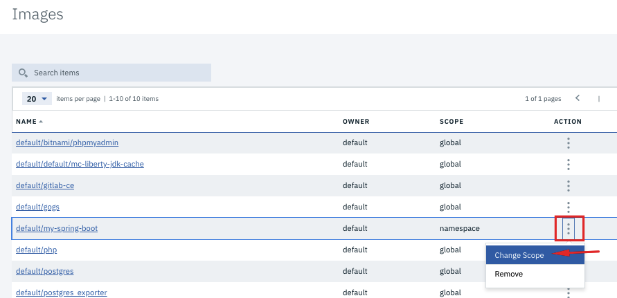
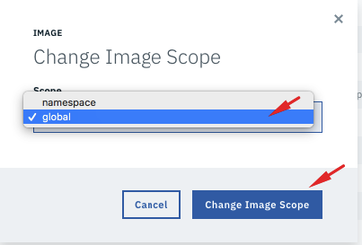
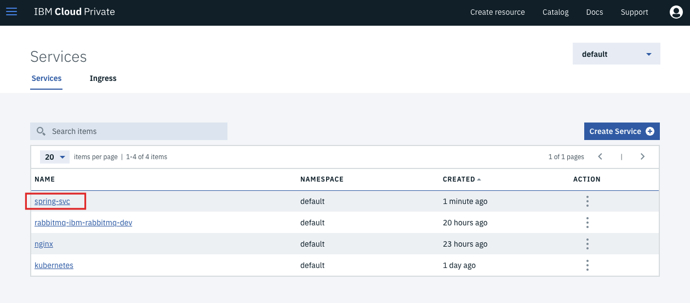
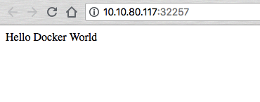
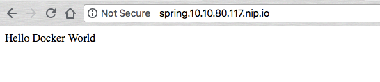

# Private Image Registry 사용하기
본 실습에서는 실습 편의를 위해 spring.io의 간단한 예제 spring 이미지를 사용하며, 
IBM Cloud Private 환경에 이미 구성되어 있는 Private Image Registry를 사용합니다. 
IBM Cloud Private 에 구성된 Private Image Registry는 DockerHub와 동일한 API를 사용하므로, DockerHub를 사용하는 방식과 동일합니다.   

본 실습에서 다룰 내용 


* 이미지 관리
  - DockerHub에 있는 Public 이미지를 Private Image Registry 에 저장 (Push)
  - Private Image Registry 내 이미지 관리 (사용자 권한별, Namespace 별)

* 이미지 사용하기 
  - Deployment 생성 
  - Service 생성 
  - 추가 => Ingress 생성해 보다 편하게 service 사용 

* 위의 내용을 Helm 패키지로 묶어 카탈로그에 등록하고 한번에 배포하기 
  - helm cli 로 만들기 
  - yaml 파일 생성


## 1. Private Image Registry에서 이미지 관리하기 

### 1-1. DockerHub에 있는 Public 이미지를 Private Image Registry에 저장(Push)
DockerHub 로부터 spring으로 작성된 이미지를 다운로드 후 Private Image Registry에 저장합니다.

1. Spring 이미지를 DockerHub에서 로컬 머신으로  Pull 합니다. 
[Spring.io/gs-spring-boot-docker 이미지](https://hub.docker.com/r/springio/gs-spring-boot-docker)

~~~
docker pull springio/gs-spring-boot-docker:latest
~~~

2. Private Image Registry에 `admin` 계정으로 로그인합니다.  (Username: admin / Password: admin)
~~~
docker login mycluster.icp:8500
~~~

3. Pull 해온 이미지를 Docker의 네이밍 컨벤션에 따라 태그합니다:`mycluster.icp:8500/namespace_name/image_name:image_tag`
~~~
docker tag springio/gs-spring-boot-docker:latest mycluster.icp:8500/default/my-spring-boot:0.1
~~~

4. 태그한 이미지를 Private Image Registry로 Push 합니다. 
~~~
docker push mycluster.icp:8500/default/my-spring-boot:0.1
~~~

    

5. 웹 콘솔에 admin 계정으로 로그인 후, Private Image Registry에 저장된 이미지를 확인합니다.  **메뉴 > Manage > Images** 클릭 
    
  저장된 이미지의 소유자는 `default` 네임스페이스이며, scope 은 해당 네임스페이스로 한정되어 있음을 확인할 수 있습니다. 

### 1-2. Private Image Registry에 저장된 이미지 가져오기 (Pull) 
1. DockerHub와 마찬가지로 Private Image Registry에 저장된 이미지를 가져올 수도 있습니다. (Pull) 
~~~
docker pull mycluster.icp:8500/default/my-spring-boot:0.1
~~~
*본 실습에서는 이미 로컬 머신에 이미지를 받은 상태이므로, 이미지가 이미 다운로드 되었다고 뜰 것입니다.*


### 1-3. 저장된 이미지 권한 관리하기 
1. Private Image Registry에 `user1`로  로그인합니다. `user1`은 `mynamespace` 에만 권한을 가지고 있습니다.  
(Username: user1 / Password: admin)

~~~
docker login mycluster.icp:8500
~~~


2. mynamespace에 저장된 `my-spring-boot:0.1` 을 pull 해봅니다. 
~~~
docker pull mycluster.icp:8500/default/my-spring-boot:0.1
~~~

`user1`는 `default` 라는 네임스페이스에 권한이 없기에 해당 네임스페이스에 속한 이미지를 사용할 수 없다는 메세지가 뜹니다. 

```
Error response from daemon: Get https://mycluster.icp:8500/v2/default/my-spring-boot/manifests/0.1: unauthorized: authentication required
```

자, 그럼 이제 이미지의 범위를 변경해 어느 namespace에서나 사용할 수 있도록 수정해보겠습니다. 


### 1-4. 이미지의 scope 을 `global` 로 변경하기 

1. 웹 콘솔에 admin 계정으로 접속해 **메뉴 > Management > Images** 클릭 

2. **해당 이미지의 Action 클릭 > Change Scope > global** 로 수정 
  

  


3. user2로 로그인 된 상태에서 다시 이미지를 pull 해봅니다. 
~~~
docker pull mycluster.icp:8500/default/my-spring-boot:0.1
~~~

4. 이번엔 특정 네임스페이스에 속하지 않는 글로벌 scope으로 설정 되어 있으므로 pull 이 가능한 것을 확인할 수 있습니다. 
  


## 2. 컨테이너 실행하기 
- 앞서 저장한 spring 컨테이너 이미지를 사용해 간단한 컨테이너를 Deployment 형태로 실행 
- Deployment를 접근 가능하도록 하기 위해 Service 를 NodePort로 생성 
- 편리하게 접근할 수 있도록 Ingress 설정 


### 2-1. 저장된 이미지로 Deloyment 만들기 
1. **메뉴 > Workloads > Deployments** 클릭

2. 우측 상단의 **Create Deployment** 클릭하여 Deployment 생성 
- General 탭에 내용 입력 
  - Name : spring
  - Namespace : default 
  - Replicas : 1
  
- Labels 탭에 입력 
  - Label : app
  - Value : spring
  
- Container settings 탭에 값 입력 
  - Name : spring
  - Image : mycluster.icp:8500/default/my-spring-boot:0.1 (Public DockerHub 이미지 사용하는 것도 가능)
  - Container port : 8080

3. Create 버튼 클릭 

### 2-2. Deployment를 외부로 노출하기 위한 Service 생성 

1. **메뉴 > Network Access > Services** 클릭 
2. 우측 상단의 **Create Service** 클릭하여 Service 생성 
- General 탭에 내용 입력 
  - Name : spring-svc
  - Namespace : default 
  - Type : NodePort

- Ports
  - Protocol : TCP
  - Name : http
  - Port : 8080
  
- Selectors 탭에 값 입력
  - Selector : app
  - Value : spring

3. **Create** 버튼 클릭 
4. 생성된 서비스 클릭
    

5. Service details 정보에서 Node port 란에 할당된 포트 번호 확인 가능. 해당 포트 번호를 클릭시 Spring 애플리케이션 접속 
    
    
    
    

  ### 2-3. Ingress 설정하기
  1. 웹 콘솔에서 **메뉴 > ddd > Services** 클릭
  2. Services 화면에서 **Ingress** 탭 클릭
  3. **Create Ingress** 버튼 클릭해 Ingress rule 생성
  - General
    - Name : spring-ingress
    - Namespace : default
  - Rules
    - Hostname : spring.<host-ip>.nip.io 
    - Service name : spring-svc
    - Service port : 8080
    
    도메인 이름이 있으면 Hostname 에 도메인을 입력하면  되나, 저희는 테스트 용도로 많이 사용되는 `nip.io`를 대안으로 사용하였습니다.
    저는 마스터 겸 프록시 노드의 IP가 10.10.80.117 이므로 `spring.10.10.80.117.nip.io` 로 입력했습니다. 


   4. Ingress가 생성되었습니다. 1-2분 후 Address 에 Proxy Node IP가 나타나면 Ingress 설정이 완료된 것입니다. 
      

   5. 이제 지정한 HOSTNAME 을 주소창에 입력해 봅니다.  
   6. 앞서 NodePort로 들어간 것과 동일하게 보이네요! 
      

   이렇게 호스트네임을 사용한 DNS 설정 뿐 아니라, ingress 설정을 통해 `proxy_ip:node_port`대신 `proxy_ip/path` 형식으로 서비스 접근을 할 수도 있습니다. 


## 3. 앞에 실행했던 내용은 Helm 패키지로 묶어 카탈로그에 업로드 하기 


1.  사용자 생성 


- image pr-registry에 저장
- 저장된 이미지 확인 
- Deployment로 만들기 
- Service 만들기 
- Ingress 만들기 
