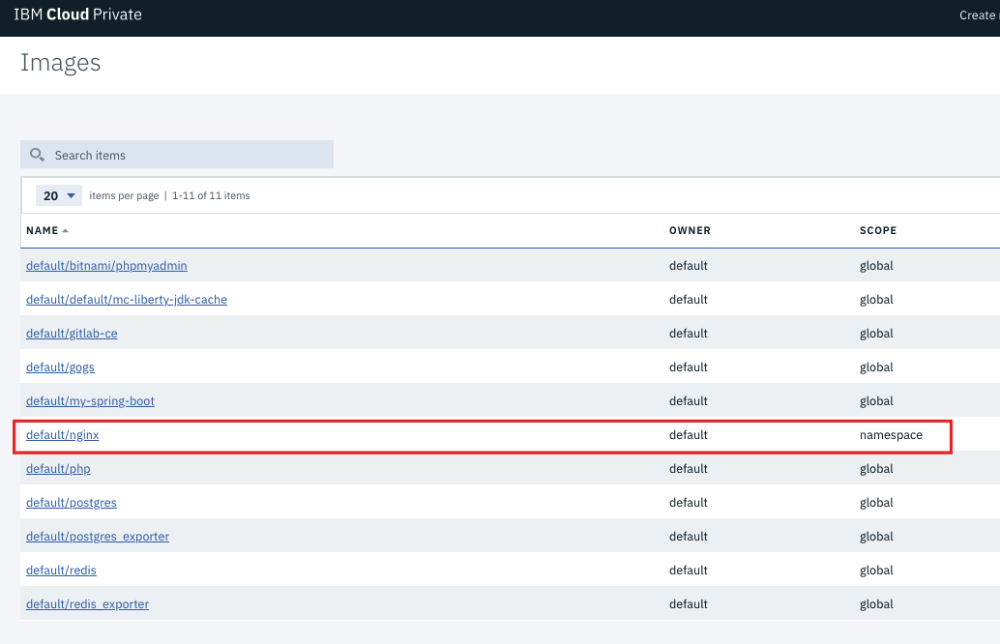
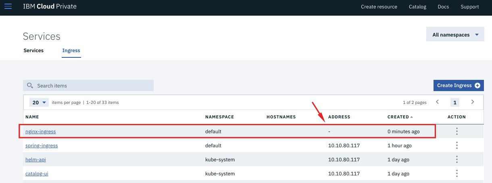
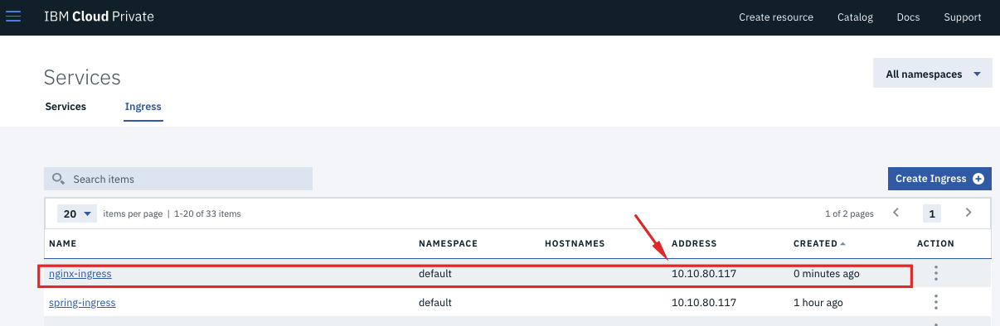

# DockerHub에서 이미지 가져와 배포하기 

본 실습에서는 실습 편의를 위해 가장 간단한 예제인 nginx 이미지를 사용하며 
IBM Cloud Private 환경에 이미 구성되어 있는 Private Image Registry를 사용합니다. 

IBM Cloud Private 에 구성된 Private Image Registry는 DockerHub와 동일한 API를 사용하므로,
DockerHub 를 사용하는 방식과 동일합니다. 

## 본 실습에서 다룰 내용
- Private Image Registry에서 안전하게 이미지 관리 
  - DockerHub에 있는 Public 이미지를 Private Image Registry에 저장 (Push)
  - Private Image Registry 내 이미지 관리 (사용자 권한별, Namespace 별)

- 저장한 이미지로 Pod 실행하기
  - Deployment 생성 
  - Service 생성
  - Ingress 생성 

## 1. Private Image Registry 에서 안전하게 이미지 관리하기 

### 1-1. DockerHub에 있는 Public 이미지를 Private Image Registry에 저장(Push)
DockerHub 로부터 spring으로 작성된 이미지를 다운로드 후 Private Image Registry에 저장합니다.

1. nginx 이미지를 DockerHub에서 로컬 머신으로 Pull 합니다. 
~~~
docker pull nginx:latest
~~~

2. Private Image Registry에 **admin** 계정으로 로그인 합니다. _**(Username: admin / Password: admin)**_
~~~
docker login mycluster.icp:8500
~~~

3. Pull 해온 이미지를 Docker의 네이밍 컨벤션에 따라 태그합니다
_mycluster.icp:8500/namespace_name/image_name:image_tag_

~~~
docker tag nginx:latest mycluster.icp:8500/default/nginx:0.1
~~~

4. 태그한 이미지를 Private Image Registry로 Push 합니다.
~~~
docker push mycluster.icp:8500/default/nginx:0.1
~~~

5. 웹 콘솔에서 **admin** 계정으로 **로그인 > 메뉴 > Manage > Images** Private Image Registry에 저장된 이미지를 확인합니다. 

_저장된 이미지의 소유자는 `default` 네임스페이스이며, `scope` 은 해당 네임스페이스로 한정되어 있음을 확인할 수 있습니다._
_default 네임스페이스에 권한이 없는 사용자는 본 이미지를 사용할 수 없도록 권한 관리를 할 수 있습니다._

Private Image Registry에 안전하게 컨테이너 이미지를 저장했습니다. 
이렇게 저장된 이미지를 Pull 해 올 수도 있습니다. 

1-2. Private Image Registry에 저장된 이미지 가져오기 (Pull)

1. DockerHub와 마찬가지로 Private Image Registry에 저장된 이미지를 가져올 수도 있습니다. (Pull) 
~~~
docker pull mycluster.icp:8500/default/nginx:0.1
~~~

_본 실습에서는 이미 로컬 머신에 이미지를 받은 상태이므로, 이미지가 이미 다운로드 되었다고 뜰 것입니다._

이렇게 Private Image Registry 에 저장된 이미지는 권한 관리가 가능합니다. 
특정 네임스페이스(Namespace) 에 속하게 할 수도 잇고, `global` 한 범위로 모든 네임스페이스에서 사용하도록 설정할 수 있습니다. 

이 때, 해당 네임스페이스에 속한 사용자만 그 이미지에 접근할 수 있게 됩니다. 

이번 실습에서는 LDAP을 연결하지 않은 관계로 데모 시연으로 보여드리겠습니다. 

## 2. 컨테이너 (Pod) 실행하기 
- 앞서 저장한 Nginx 컨테이너 이미지를 Deployment 형태로 실행
- Service 를 NodePort로 생성
- 편리성을 위해 Ingress 설정 

### 2-1. Deloyment 생성
1. **메뉴 > Workloads > Deployments** 클릭

2. 우측 상단의 **Create Deployment** 클릭하여 Deployment 생성 

- General 탭에 내용 입력 
  - Name : nginx
  - Namespace : default 
  - Replicas : 1
  
- Labels 탭에 입력 
  - Label : app
  - Value : nginx
  
- Container settings 탭에 값 입력 
  - Name : nginx
  - Image : mycluster.icp:8500/default/nginx:0.1 (Public DockerHub 이미지 사용하는 것도 가능)
  - Container port : 80
  
3. **Create** 버튼 클릭 

### 2-2. Nginx 애플리케이션에 접근하기 위한 NodePort Service 생성 

1. **메뉴 > Network Access > Services** 클릭 
2. 우측 상단의 **Create Service** 클릭하여 Service 생성 
- General 탭에 내용 입력 
  - Name : nginx-svc
  - Namespace : default 
  - Type : NodePort

- Ports
  - Protocol : TCP
  - Name : http
  - Port : 80
  - TargetPort : 80
  
- Selectors 탭에 값 입력
  - Selector : app
  - Value : nginx
  
3. **Create** 버튼 클릭 
4. 생성된 서비스 클릭

5. Service details 정보에서 Node port 란에 할당된 포트 번호 확인 가능. 해당 포트 번호를 클릭시 Nginx 애플리케이션 접속 

NodePort로 접속하는 애플리케이션은 
_**http://[proxy-node-ip]:NODE_PORT**_ 형태로 접속하게 됩니다. 

### 2-3. Ingress 설정하기 
 Kubernetes에서는 기본적으로 Service NodePort 를 사용해 Pod에 접근하며, 
 Service와 함께 **Ingress** 를 사용해 클러스터 서비스로 들어오는 인바운드 연결에 대한 규칙을 설정할 수도 있습니다. 
  
1. 웹 콘솔에서 **메뉴 > Network Access > Services** 클릭
2. Services 화면에서 **Ingress** 탭 클릭
3. **Create Ingress** 버튼 클릭해 Ingress rule 생성
  - General
    - Name : nginx-ingress
    - Namespace : default
  - Annotations
    - ingress.kubernetes.io/rewrite-target : /
  - Rules
    - Service name : nginx-svc
    - Service port : 80
    - Path : /hello-nginx
 
 4. Ingress가 생성되었습니다. 1-2분 후 Address 에 Proxy Node IP가 나타나면 Ingress 설정이 완료된 것입니다. 

5. 이제 _**https://[proxy-node-ip]/hello-nginx**_ 를 주소창에 입력합니다. 

이렇게 Ingress 설정을 통해 `proxy_ip:node_port`대신 `proxy_ip/path` 형식으로 path를 지정할 있습니다. 

